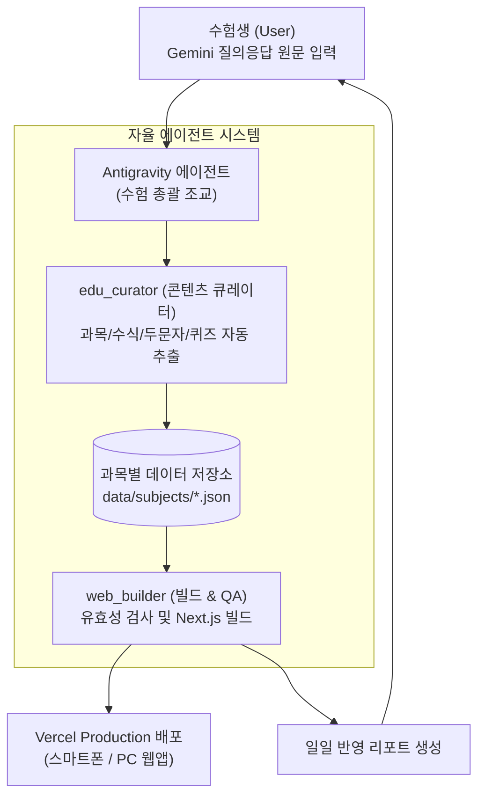

# 🎓 EduPass 2026 : 공인중개사 스마트 수험 지식 웹서비스

> **Gemini AI 문답 기반 일일 자율 학습 & 실시간 수식/퀴즈/플래시카드 웹 플랫폼**  
> Vercel 글로벌 원클릭 배포 지원 및 자율 에이전트(`edu_curator`, `web_builder`) 연동

---

## 📌 1. 프로젝트 개요 (Overview)

공인중개사 시험(1차·2차 6개 과목)은 방대한 암기량과 까다로운 계산 문제(부동산학개론, 세법 등)로 인해 체계적인 반복 학습이 필수적입니다.

**EduPass 2026**은 수험생이 공부하면서 Gemini에게 질문하고 얻은 **비정형 답변 및 학습 메모를 채팅창에 전달하기만 하면**, Antigravity 에이전트 시스템이 이를 분석하여 **인터랙티브 계산기, 두문자 플래시카드, 실전 기출 OX 퀴즈**로 자동 구조화하고, **Vercel을 통해 모바일/태블릿/PC에서 즉시 공부할 수 있도록 자동 배포**해 주는 스마트 수험 플랫폼입니다.

---

## 🚀 2. 주요 기능 (Core Features)

| **🔥 취약점 집중 돌파 (Weak-Point Lab)** | • **적응형 약점 공략**: 내가 '헷갈림/어려움'으로 체크한 카드 및 오답 퀴즈만 1초 만에 필터링<br>• **LocalStorage 영구 보관**: 브라우저를 닫아도 나만의 오답노트와 학습 진도 영구 유지<br>• 원클릭 기록 초기화 기능 제공 |
| **🧮 계산식 마스터 랩 (Formula Lab)** | • **KaTeX 수식 렌더링**: 탄력성, 영업현금흐름(순영영세세), 균형가격, 자기자본수익률(ROE) 등 수식 시각화<br>• **실시간 계산 시뮬레이터**: 숫자를 직접 변경하면 결과값이 즉시 산출<br>• **🎲 실전 숫자 랜덤 생성기**: 버튼 클릭 시 기출 변형 숫자가 무작위 대입되어 실전 응용력 극대화 |
| **🗂️ 두문자 플래시카드 (Flashcards)** | • **3D 카드 플립 애니메이션**: 카드 앞면(주제) / 뒷면(암기팁, 해설)<br>• **망각곡선 복습 체크**: `완벽함`, `헷갈림`, `어려움` 상태 분리 관리<br>• **🎧 핸즈프리 오디오 (TTS)**: 카드 내용을 한국어 음성으로 연속 자동 낭독하여 출퇴근/이동 중 청취 학습<br>• **카드 섞기(Shuffle)** 기능 지원 |
| **⚡ 스피드 OX & 실전 퀴즈 (Quiz Arena)** | • 시험에 빈출되는 판례 및 법령 지문을 즉시 판별하는 O/X 퀴즈<br>• 5지선다 객관식 지원 및 오답 자동 수집<br>• **오답 집중 다시 풀기**: 틀린 문제만 모아 즉시 재도전 가능<br>• 함정 키워드 상세 해설 제공 |
| **⏱️ D-Day & 합격 로드맵 게이지** | • 2026년 공인중개사 시험일 카운트다운 타이머 탑재<br>• 1차 과목(학개론, 민법) 및 2차 과목(중개사법, 공법, 공시세법) 진도율 실시간 시각화 |
| **📥 스마트 인제스터 (Gemini Ingestion)** | • 날것의 Gemini 대화 텍스트 붙여넣기 시 과목/유형/키워드 자동 판별 프리뷰 |
| **📅 오늘의 복습 (Daily Study Log)** | • 매일 공부하여 추가된 내용을 날짜별 타임라인으로 모아 잠들기 전 5분 복습 |

---

## 🏗️ 3. 시스템 구조 및 에이전트 파이프라인 (System Architecture)



---

## 🛠️ 4. 기술 스택 (Tech Stack)

* **Frontend:** Next.js 14 (App Router), React 18, TypeScript
* **Styling:** Tailwind CSS, Lucide React Icons
* **Math Engine:** KaTeX (`katex`, `react-katex`)
* **Data & CLI Pipeline:** Python 3.14, Pydantic, Rich
* **Deployment:** Vercel (Edge Network)

---

## 📁 5. 프로젝트 디렉토리 구조

```
eduwill_2026/
├── data/
│   ├── subjects/
│   │   ├── 01_intro.json        # 부동산학개론 (계산식, 탄력성, 투자론)
│   │   ├── 02_civil_law.json    # 민법 및 민사특별법 (통정허위표시, 취득시효)
│   │   ├── 03_broker_law.json   # 공인중개사법령 (절대적등록취소 두문자)
│   │   ├── 04_public_law.json   # 부동산공법 (건폐율 암기코드)
│   │   ├── 05_disclosure.json   # 공시법 (지번 북서기번법)
│   │   └── 06_tax_law.json      # 세법 (양도세 필요경비, 조세분류 치트키 취등재·농부·보처소)
│   └── daily_logs.json          # 날짜별 학습 타임라인
├── docs/
│   └── AGENT_SYSTEM.md          # 에이전트 시스템 아키텍처 명세서
├── scripts/
│   └── validate_data.py         # Pydantic 기반 수험 데이터 무결성 검증기
├── src/
│   ├── app/
│   │   ├── globals.css          # 글로벌 스타일 및 애니메이션
│   │   ├── layout.tsx           # 네비게이션 헤더 및 레이아웃
│   │   └── page.tsx             # 메인 대시보드 (탭 모드 전환 & 검색)
│   ├── components/
│   │   ├── FlashcardDeck.tsx    # 두문자 플래시카드
│   │   ├── FormulaLab.tsx       # 인터랙티브 계산기 랩
│   │   ├── GeminiIngester.tsx   # Gemini 텍스트 인제스터 프리뷰
│   │   ├── KatexRenderer.tsx    # KaTeX 수식 렌더러
│   │   └── QuizArena.tsx        # OX 및 실전 객관식 퀴즈
│   ├── lib/
│   │   ├── data.ts              # 데이터 로더 및 과목 메타정보
│   │   └── storage.ts           # LocalStorage 영구 보관 (마스터리, 오답노트)
│   └── types/
│       └── study.ts             # TypeScript 타입 정의
├── run.bat                      # Windows 원클릭 실행 스크립트
├── run.sh                       # Linux/macOS 실행 스크립트
├── vercel.json                  # Vercel 배포 설정
├── requirements.txt             # 파이썬 의존성
└── package.json                 # Node 의존성
```

---

## 💻 6. 설치 및 실행 가이드 (Setup & Usage)

### [방법 1] 원클릭 실행 스크립트 사용 (권장)

* **Windows:**
  ```cmd
  run.bat
  ```
  콘솔 메뉴에서 `1`을 입력하면 개발 서버가 구동되고, `2`를 입력하면 빌드 검증이 수행됩니다.

* **macOS / Linux:**
  ```bash
  chmod +x run.sh
  ./run.sh
  ```

### [방법 2] 수동 명령어 실행

1. **Node 의존성 설치 및 로컬 서버 시작:**
   ```bash
   npm install
   npm run dev
   ```
   브라우저에서 `http://localhost:3000`으로 접속합니다.

2. **Python 데이터 검증 도구 실행:**
   ```bash
   # 가상환경 활성화 후
   pip install -r requirements.txt
   python scripts/validate_data.py
   ```

---

## 🌐 7. Vercel 배포 방법 (Deployment)

1. **GitHub 저장소에 코드 Push:**
   ```bash
   git init
   git add .
   git commit -m "feat: Initial release of EduPass 2026"
   git remote add origin <사용자_깃허브_리포지토리_URL>
   git push -u origin main
   ```
2. **Vercel 대시보드(vercel.com) 연결:**
   * `Add New Project` ➔ 해당 GitHub 저장소 선택 ➔ `Deploy` 클릭
   * Next.js 프레임워크가 자동 인식되어 **별도 환경설정 없이 1분 내 글로벌 배포 완료**됩니다.
3. 이후 에이전트와 대화하며 데이터가 업데이트되면 Git Push와 동시에 Vercel에 자동 재배포됩니다.

---

## 💡 8. 일일 학습 업데이트 이용 방법 (How to Use with Agent)

1. 평소처럼 Gemini와 공인중개사 공부를 진행합니다.
2. 유익한 답변이나 암기팁, 계산 공식이 나오면 **텍스트를 복사하여 본 대화창에 편하게 붙여넣습니다**.
   * 예: *"오늘 학개론 균형가격 계산법 Gemini한테 물어봤는데 이거 반영해줘: [복사한 내용]"*
3. 에이전트가 알아서 과목 분류, 계산식 수식화, OX 퀴즈를 생성하여 웹에 반영하고 요약 리포트를 드립니다.
