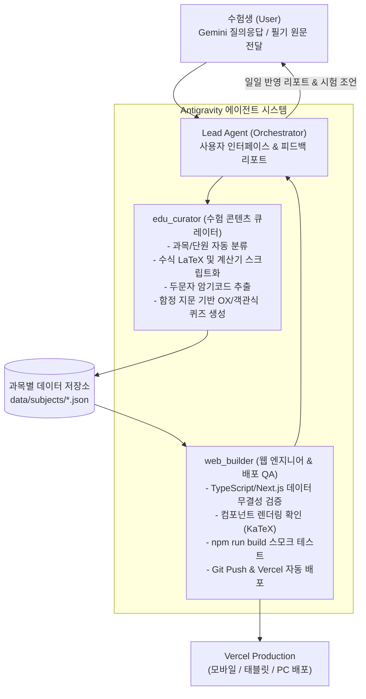

# EduPass 2026 에이전트 시스템 아키텍처 및 운영 가이드

본 문서는 **공인중개사 자격시험 수험생(User)**과 **AI 에이전트 시스템(Antigravity Agentic System)**이 유기적으로 협력하여, 매일의 공부 내용을 웹서비스로 실시간 자율 반영하는 아키텍처와 운영 절차를 규정합니다.

---

## 1. 시스템 개요 및 에이전트 역할 분담

수험생은 복잡한 데이터 구조화(JSON)나 웹 개발, 배포를 전혀 신경 쓰지 않고 **공부와 Gemini 질의응답에만 전념**합니다. 수험생이 공부 중 얻은 날것의 메모나 Gemini 대화 원문을 채팅창에 입력하면, 에이전트 시스템이 다단계로 파이프라인을 가동합니다.

---

## 2. 세부 서브에이전트 명세

### ① `edu_curator` (수험 콘텐츠 큐레이터)
* **목적:** 날것의 비정형 텍스트에서 1차/2차 공인중개사 시험에 최적화된 학습 요소를 추출합니다.
* **추출 항목:**
  1. **과목 & 단원 태깅:** 학개론, 민법, 중개사법, 공법, 공시법, 세법 6개 과목 중 적절한 위치 매핑.
  2. **수식 파싱:** 계산 공식이 포함된 경우, LaTeX 문법 변환 및 브라우저에서 실시간 계산 가능한 자바스크립트 로직(`calculateScript`)과 변수 목록(`variables`) 생성.
  3. **두문자 암기 추출:** 앞 글자를 딴 암기 코드(예: `가-공-기=유`, `결등양대2사부정`) 및 세부 해설 구조화.
  4. **함정 지문 퀴즈화:** 시험 단골 오답 포인트(예: "임의적 vs 절대적", "선의 vs 무과실")를 발라내어 즉시 OX 문제 생성.

### ② `web_builder` (웹 플랫폼 & 배포 QA)
* **목적:** 큐레이팅된 데이터가 웹에서 에러 없이 렌더링되고, 빌드 무결성을 통과한 후 Vercel에 자동 배포되도록 보장합니다.
* **수행 절차:**
  1. `python scripts/validate_data.py` 실행을 통한 스키마 검증.
  2. `npm run build`를 통한 Next.js 빌드 스모크 테스트 수행.
  3. Git Commit & Push로 Vercel 자동 재배포 트리거.

---

## 3. 매일 진행되는 대화 프로토콜 (Daily Protocol)

1. **[User] 공부 내용 입력:**
   - 형식 제한 없이 Gemini와의 대화 복사/붙여넣기
   - *"오늘 학개론 탄력성 공부했는데 이거 반영해줘: [원문]"*
2. **[Agent] 자체 검토 및 데이터 증분 병합 (Incremental Merge):**
   - 기존 과목 JSON 파일을 열어 중복 여부 확인
   - 새로운 개념 추가 또는 기존 개념에 판례/기출 팁 보강
   - `data/daily_logs.json`에 오늘 날짜 학습 요약 기록
3. **[Agent] 스모크 테스트 & 자동 배포:**
   - `python scripts/validate_data.py`
   - `npm run build`
4. **[Agent] 최종 리포트 회신:**
   - 오늘 추가된 개념, 계산식, 퀴즈 요약 전달
   - 실제 수험장 팁과 배포된 웹페이지 링크 안내
